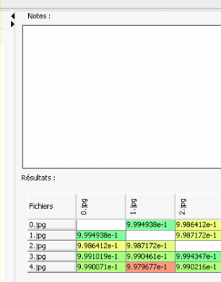

Débuter l'analyse
-----------------
Lorsque vous avez selectionné les fichiers à analyser, vous pouvez cliquer sur le bouton "Lancer l'analyse" .

La barre de progression, située sous les boutons, et la barre de statut en bas de l'application, indiquent alors où en est le processus.

Lorsque la première partie de l'analyse est terminée, un nouveau panneau s'ouvre sur la droite de l'application.

Il contient :

* Une zone de prise de notes (que vous pouvez utiliser pour enregistrer vos impressions ou vos doutes par exemple).
* Un tableau affichant la matrice de distances des fichiers les uns par rapport aux autres

Stopper une analyse
-------------------
Vous pouvez aussi annuler à tout moment l'analyse en cours en cliquant sur le bouton "Stopper l'analyse" . 