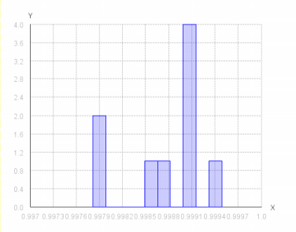
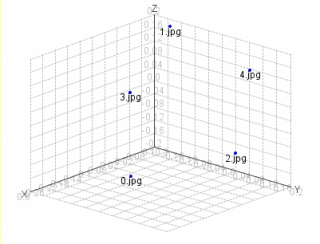
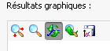

La vue 2D
---------
La vue 2D est un histogramme qui représente la répartition des distances par rapport aux fichiers  
Si l'on observe par exemple une barre bien plus à gauche que la majorité des autres fichiers, on peut imaginer qu'il y a une fraude dans les données analysées.

La vue 3D
---------
Cette 2ème vue peut être très utile car elle donne une idée des distances relatives entre chaque points.
Si il y a une fraude, alors on verra les deux points qui la représentent plus proches que la majorité des autres points.

Outils
------
Les graphiques possèdent des outils pratiques pour faciliter leur exploitation.

On retrouve les fonctions classique, dans l'ordre :

* Centrer les axes
* Zoomer
* Orienter la vue (en 3D seulement)
* Revenir à la position par defaut
* Enregistrer le graphique (au format PNG)
