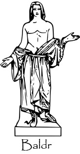

Baldr alias Balder est un logiciel de lutte contre le plagiat et la fraude.

Inspiré des recherches en informatique théorique, Baldr un logiciel qui réalise la comparaison de documents en utilisant des propriétés liées à la compression. 

Le nom du projet est tiré de la mythologie scandinave. Baldr (vieil islandais Baldr, latin Balderus) était un des Ases, le fils d'Odin et de Frigg. Il est le dieu de l'innocence. 